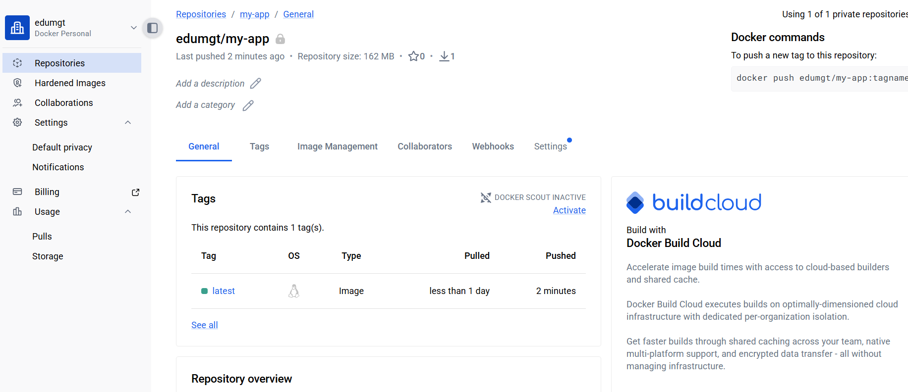

# Canvas Drawing Tool (Vite + Vanilla JS + Node.js)

Canvas API 기반 드로잉 툴에 **Node.js 서버 모듈**을 결합해, 캔버스 결과를 서버 storage에 UUID 기반 SVG 파일로 저장/조회할 수 있도록 확장한 프로젝트입니다.

## 주요 기능

- 자유 곡선 드로잉
- 색상 선택 및 브러시 굵기 조절
- 지우개
- 직선/사각형/원 도형 그리기
- PNG/JPG 이미지 저장
- 모눈 종이 배경 토글
- 화면 크기에 맞춘 캔버스 리사이즈
- 서버 저장: 캔버스 결과를 SVG로 변환 후 `storage/<uuid>.svg` 파일로 저장
- 저장 목록 조회 및 기존 SVG 불러오기

## 서버 저장/불러오기 동작

1. FE에서 `Save SVG to Server` 클릭
2. 캔버스 2개 레이어(배경 + 드로잉)를 병합 후 SVG 문자열 생성
3. `POST /api/svgs` 호출
4. Node.js 서버가 UUID 파일명으로 `storage/*.svg` 저장
5. `GET /api/svgs`로 목록 조회, `GET /api/svgs/:fileName`으로 SVG 불러오기

## 기술 스택

### Frontend
- Vite
- Vanilla JavaScript
- Tailwind CSS
- Canvas API

### Backend
- Node.js 20
- Node.js built-in HTTP server
- File System Storage (`/storage`)
- UUID(`crypto.randomUUID`)

### DevOps / Runtime
- Docker (멀티 스테이지 빌드)
- GitHub Actions (Docker build/push workflow)

## 로컬 개발

```bash
npm install
npm run dev
```

서버 API를 로컬에서 함께 확인하려면 별도 터미널에서:

```bash
npm run dev:server
```

- FE(dev): `http://localhost:5173`
- API(server): `http://localhost:3000/api/health`

## 프로덕션 빌드/실행

```bash
npm run build
npm run start
```


## 포트 정리 + Docker 3000 실행 (자동)

기존 `3000`, `5173`, `8080` 포트를 사용 중인 **로컬 프로세스 종료 + 해당 포트를 매핑 중인 Docker 컨테이너 중지** 후,
Node 기반 Docker 컨테이너를 `3000` 포트로 다시 실행할 수 있습니다.

```bash
npm run docker:run:3000
```

실행 내용:
- 포트 `3000/5173/8080` 점유 로컬 PID 강제 종료
- 포트 `3000/5173/8080` 매핑 중인 실행 컨테이너 중지
- `canvas-node-app` 이미지 빌드
- `canvas-app` 컨테이너를 `-p 3000:3000`으로 실행
- `storage`를 볼륨 마운트해 SVG 저장 파일 유지

## Docker

### 이미지 빌드

```bash
docker build -t canvas-node-app .
```

### 컨테이너 실행 (storage 볼륨 마운트 권장)

```bash
docker run -d -p 3000:3000 -v $(pwd)/storage:/app/storage --name canvas-app canvas-node-app
```

이렇게 실행하면 컨테이너 재시작/재생성 후에도 저장된 SVG 파일이 호스트 `storage` 디렉터리에 유지됩니다.

## API 요약

- `GET /api/health`: 서버 상태 확인
- `GET /api/svgs`: 저장된 SVG 파일 목록 조회
- `POST /api/svgs`: SVG 저장 (`{ "svgContent": "<svg ...>" }`)
- `GET /api/svgs/:fileName`: 개별 SVG 반환

---



# GitHub Actions + Docker Hub 연동 노트

이 문서는 GitHub Actions로 Docker 이미지를 빌드/푸시할 때 필요한 설정과 트러블슈팅을 정리한 기록입니다.

## 1) Docker Hub 인증 정보 저장

GitHub 저장소에서 **Settings → Secrets and variables → Actions** 로 이동해 다음 값을 등록합니다.

### Secrets
- `DOCKERHUB_USERNAME`: Docker Hub 계정 ID
- `DOCKERHUB_TOKEN`: Docker Hub Personal Access Token(PAT)


### Variables
- `IMAGE_NAME`: 이미지 이름(예: `my-app`)
- `ENV`: 환경 구분 값(예: `prod`)

**Secrets vs Variables**
- **Secrets**: 토큰/비밀번호 등 민감 값 저장용
- **Variables**: 공개 가능한 일반 값 저장용

## 2) GitHub Actions 워크플로 예시

```yaml
name: CI/CD with Docker Hub

on:
  push:
    branches: [ "main" ]

jobs:
  build-and-push:
    runs-on: ubuntu-latest
    steps:
      - name: Checkout Repository
        uses: actions/checkout@v3

      - name: Set up Docker Buildx
        uses: docker/setup-buildx-action@v2

      - name: Log in to Docker Hub
        uses: docker/login-action@v2
        with:
          username: ${{ secrets.DOCKERHUB_USERNAME }}
          password: ${{ secrets.DOCKERHUB_TOKEN }}

      - name: Build and Push Docker Image
        uses: docker/build-push-action@v4
        with:
          context: .
          push: true
          tags: ${{ secrets.DOCKERHUB_USERNAME }}/my-app:latest
```

### 동작 흐름
1. `main` 브랜치에 push
2. GitHub Actions runner 실행
3. 이미지 빌드 후 Docker Hub에 push

필요하면 이 파이프라인을 AWS/ECS/EC2 배포로 확장 가능합니다.

## 3) 트러블슈팅

### Dockerfile을 찾을 수 없을 때

에러 예시:

```
ERROR: failed to read dockerfile: open Dockerfile: no such file or directory
```

**원인**
- 저장소 루트에 `Dockerfile`이 없거나 경로가 다름

**해결 방법**
- 루트에 `Dockerfile`을 두거나
- `docker/build-push-action`에 `file` 경로를 지정합니다.

```yaml
- name: Build and Push Docker Image
  uses: docker/build-push-action@v4
  with:
    context: .
    file: ./docker/Dockerfile
    push: true
    tags: ${{ secrets.DOCKERHUB_USERNAME }}/my-app:latest
```

### 토큰 권한 부족(401 Unauthorized)

에러 예시:

```
401 Unauthorized: access token has insufficient scopes
```

**원인**
- Docker Hub PAT 권한이 `Read-only`로 생성됨
- `tags`에 설정한 계정/레포가 실제 토큰 소유자와 다름

**해결 방법**
1. Docker Hub에서 **Read & Write** 권한으로 PAT 재발급
2. `tags` 값에 본인 계정/레포를 정확히 지정

```yaml
- name: Log in to Docker Hub
  uses: docker/login-action@v2
  with:
    username: ${{ secrets.DOCKERHUB_USERNAME }}
    password: ${{ secrets.DOCKERHUB_TOKEN }}

- name: Build and Push Docker Image
  uses: docker/build-push-action@v4
  with:
    context: .
    push: true
    tags: ${{ secrets.DOCKERHUB_USERNAME }}/my-app:latest
```


