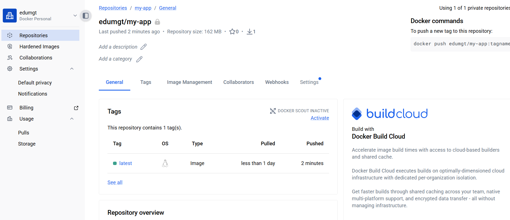

# AI Canvas Drawing App

## 📋 프로젝트 개요

> **Docker Compose + MariaDB + JWT 인증 + AI(Ollama LLaVA) 기반 캔버스 드로잉 툴**

이 프로젝트는 아래 요구사항을 충족하는 풀스택 드로잉 애플리케이션입니다:

- **Docker Compose**로 MariaDB, Node.js 앱, Ollama AI 서비스 구성
- **MariaDB 회원 테이블** 생성 및 JWT 기반 인증
- 테스트 계정: `test1@test.com / 123456`, `test2@test.com / 123456`
- 로그인 후 **좌측 Offcanvas 패널**에서 본인의 저장 작업 목록을 날짜별로 확인
- 저장 날짜 클릭 시 해당 시점의 캔버스 내용을 복원
- 캔버스 **💾 저장** 버튼으로 서버(MariaDB)에 저장
- **Tailwind CSS** 기반 전체 UI 디자인
- **🤖 AI Help** 버튼 클릭 시 Ollama LLaVA 모델이 스케치를 분석하여 자연스러운 이미지로 표현한 상세 묘사 제공
- Docker Compose로 Ollama 서비스 연동

---

## 🚀 빠른 시작 (Docker Compose)

```bash
# 1. 서비스 시작
docker compose up -d --build

# 2. (최초 1회) LLaVA 모델 다운로드 (~4.7 GB)
docker compose exec ollama ollama pull llava

# 3. 브라우저에서 접속
open http://localhost:3000
```

> **Ollama 없이도** 캔버스 드로잉/저장/불러오기는 정상 동작합니다.  
> AI Help 기능만 Ollama + LLaVA 모델이 필요합니다.

---

## 🔐 인증 / 테스트 계정

| 이메일 | 비밀번호 |
|--------|----------|
| test1@test.com | 123456 |
| test2@test.com | 123456 |

- 서버 최초 기동 시 MariaDB에 자동 생성(bcrypt 해싱)
- JWT 토큰 유효기간: **24시간**
- 토큰은 브라우저 `localStorage`에 저장

---

## 🏗 아키텍처

```
Browser (Vite + Vanilla JS + Tailwind CSS)
    │  JWT Bearer Token
    ▼
Node.js HTTP Server (server.js)
    ├── POST /api/auth/login        — 로그인, JWT 발급
    ├── GET  /api/auth/me           — 현재 사용자 확인
    ├── GET  /api/saves             — 저장 목록 조회
    ├── POST /api/saves             — 캔버스 저장
    ├── GET  /api/saves/:id         — 특정 저장본 로드
    ├── DELETE /api/saves/:id       — 삭제
    └── POST /api/ai/enhance        — Ollama LLaVA 프록시
          │
          ├── MariaDB 11 (users, canvas_saves)
          └── Ollama (llava vision model)
```

---

## 🎨 주요 기능

### 드로잉 도구
- **펜** / **지우개** / **직선** / **사각형** / **원**
- 색상 선택, 브러시 굵기 조절
- 모눈 종이 배경 토글
- PNG / JPG 로컬 다운로드

### 저장 / 불러오기 (MariaDB)
1. 그림을 그린 후 **💾 저장** 클릭
2. 좌측 **☰ 메뉴** → 날짜별 저장 목록 확인
3. 저장 항목 클릭 → 해당 캔버스 복원
4. ✕ 버튼으로 특정 저장본 삭제

### AI Help (Ollama LLaVA)
1. 스케치를 그린 후 **🤖 AI Help** 클릭
2. 캔버스 이미지를 Ollama LLaVA 모델로 전송
3. AI가 스케치를 분석하여 **자연스러운 이미지 묘사** 반환
4. 원본 스케치 + AI 묘사를 모달에서 확인

---

## 🐳 Docker Compose 서비스 구성

| 서비스 | 이미지 | 포트 | 설명 |
|--------|--------|------|------|
| `app` | 커스텀 빌드 | 3000 | Node.js 앱 서버 |
| `db` | mariadb:11 | (내부) | MariaDB 데이터베이스 |
| `ollama` | ollama/ollama:latest | 11434 | AI 모델 서버 |

### 환경 변수 (app 서비스)

| 변수 | 기본값 | 설명 |
|------|--------|------|
| `DB_HOST` | db | MariaDB 호스트 |
| `DB_PORT` | 3306 | MariaDB 포트 |
| `DB_USER` | canvasuser | DB 사용자 |
| `DB_PASSWORD` | canvaspass | DB 비밀번호 |
| `DB_NAME` | canvasdb | 데이터베이스 명 |
| `JWT_SECRET` | (기본값 변경 필수) | JWT 서명 키 |
| `OLLAMA_URL` | http://ollama:11434 | Ollama API URL |

---

## 🗃 데이터베이스 스키마

```sql
-- 회원 테이블
CREATE TABLE users (
  id            INT AUTO_INCREMENT PRIMARY KEY,
  email         VARCHAR(255) NOT NULL UNIQUE,
  password_hash VARCHAR(255) NOT NULL,
  created_at    TIMESTAMP DEFAULT CURRENT_TIMESTAMP
);

-- 캔버스 저장 테이블
CREATE TABLE canvas_saves (
  id          INT AUTO_INCREMENT PRIMARY KEY,
  user_id     INT      NOT NULL,
  canvas_data LONGTEXT NOT NULL,        -- base64 PNG data URL
  created_at  TIMESTAMP DEFAULT CURRENT_TIMESTAMP,
  FOREIGN KEY (user_id) REFERENCES users(id) ON DELETE CASCADE
);
```

---

## 🛠 로컬 개발

```bash
# 의존성 설치
npm install

# 프론트엔드 dev 서버 (포트 5173)
npm run dev

# 백엔드 서버 (포트 3000)
# MariaDB가 localhost:3306에서 실행 중이어야 합니다
DB_HOST=localhost npm run dev:server
```

---

## 📦 기술 스택

### Frontend
- **Vite** (빌드 도구)
- **Vanilla JavaScript** (ES Modules)
- **Tailwind CSS** (UI 디자인)
- **Canvas API** (드로잉)

### Backend
- **Node.js 20** (HTTP 서버)
- **mysql2** (MariaDB 드라이버)
- **jsonwebtoken** (JWT 인증)
- **bcryptjs** (비밀번호 해싱)

### AI
- **Ollama** (로컬 AI 모델 서버)
- **LLaVA** (Large Language and Vision Assistant — 스케치 이미지 분석)

### Infrastructure
- **Docker** (멀티스테이지 빌드)
- **Docker Compose** (서비스 오케스트레이션)
- **MariaDB 11** (데이터 영속성)
- **GitHub Actions** (CI/CD)

---

## 🔌 API 요약

| Method | Path | Auth | 설명 |
|--------|------|------|------|
| GET | /api/health | ✗ | 서버 상태 |
| POST | /api/auth/login | ✗ | 로그인 |
| GET | /api/auth/me | ✓ | 현재 사용자 |
| GET | /api/saves | ✓ | 저장 목록 |
| POST | /api/saves | ✓ | 캔버스 저장 |
| GET | /api/saves/:id | ✓ | 저장본 조회 |
| DELETE | /api/saves/:id | ✓ | 저장본 삭제 |
| POST | /api/ai/enhance | ✓ | AI 스케치 분석 |

---

## ⚠️ 프로덕션 배포 시 주의사항

1. `docker-compose.yml`의 `JWT_SECRET`을 **암호학적으로 안전한 랜덤 문자열(최소 32자)**로 교체하세요.  
   생성 명령: `openssl rand -hex 32`
2. MariaDB 비밀번호도 강력한 값으로 변경하세요
3. HTTPS를 적용하는 리버스 프록시(nginx, Caddy 등) 사용을 권장합니다

---



# GitHub Actions + Docker Hub 연동 노트

이 문서는 GitHub Actions로 Docker 이미지를 빌드/푸시할 때 필요한 설정과 트러블슈팅을 정리한 기록입니다.

## 1) Docker Hub 인증 정보 저장

GitHub 저장소에서 **Settings → Secrets and variables → Actions** 로 이동해 다음 값을 등록합니다.

### Secrets
- `DOCKERHUB_USERNAME`: Docker Hub 계정 ID
- `DOCKERHUB_TOKEN`: Docker Hub Personal Access Token(PAT)


### Variables
- `IMAGE_NAME`: 이미지 이름(예: `my-app`)
- `ENV`: 환경 구분 값(예: `prod`)

## 2) GitHub Actions 워크플로 예시

```yaml
name: CI/CD with Docker Hub

on:
  push:
    branches: [ "main" ]

jobs:
  build-and-push:
    runs-on: ubuntu-latest
    steps:
      - name: Checkout Repository
        uses: actions/checkout@v3

      - name: Set up Docker Buildx
        uses: docker/setup-buildx-action@v2

      - name: Log in to Docker Hub
        uses: docker/login-action@v2
        with:
          username: ${{ secrets.DOCKERHUB_USERNAME }}
          password: ${{ secrets.DOCKERHUB_TOKEN }}

      - name: Build and Push Docker Image
        uses: docker/build-push-action@v4
        with:
          context: .
          push: true
          tags: ${{ secrets.DOCKERHUB_USERNAME }}/my-app:latest
```

## 3) 트러블슈팅

### Dockerfile을 찾을 수 없을 때

```
ERROR: failed to read dockerfile: open Dockerfile: no such file or directory
```

루트에 `Dockerfile`을 두거나 `file` 경로를 지정합니다.

### 토큰 권한 부족(401 Unauthorized)

Docker Hub PAT를 **Read & Write** 권한으로 재발급하고 `tags`를 정확히 지정합니다.
